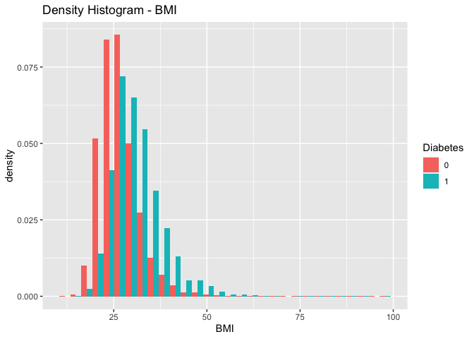
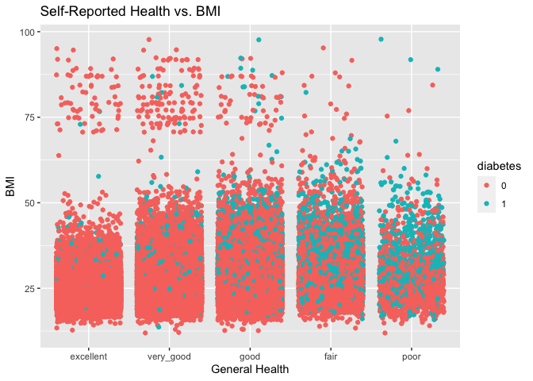
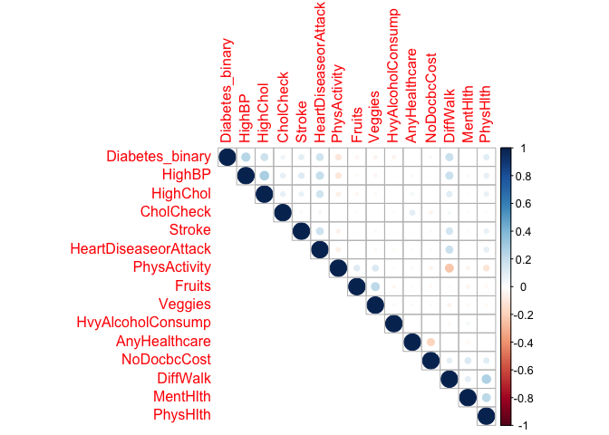
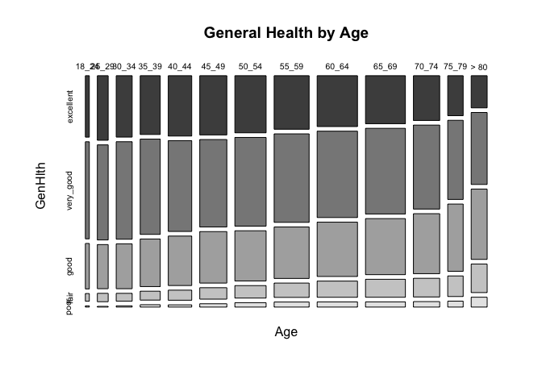

558_Project_3
================
ankit gupta & brian higginbotham
2023-11-08

    ## [1] "CollegeGrad"

# Introduction

In this analysis, we explore a dataset focusing on diabetes, utilizing R
for our examination. The dataset contains essential variables that offer
insights into various aspects related to diabetes. The key variables we
will be working with include demographic information, physiological
measurements, and medical indicators. It is important to note that the
dataset contains information from individuals with and without diabetes,
making it a valuable resource for understanding the factors associated
with the condition

Our primary goal is to conduct an in-depth Exploratory Data Analysis to
gain insights into the relationships between various variables and the
presence or absence of diabetes. Through statistical summaries,
visualizations, and correlation analyses, we aim to uncover patterns,
identify potential predictors, and understand the distribution of key
features within the dataset, mainly BMI, General Health, Age and Income.

Furthermore, we will develop predictive models to explore the ability of
the selected variables to accurately predict diabetes outcomes. We plan
to employ machine learning techniques, such as logistic regression or a
support vector machine, to select a best model that can effectively
classify individuals as diabetic or non-diabetic based on the available
features.

# Data

For the longer categorical variables - education, age, and income - the
initial data set did not provide a thorough description of the
categories. References to [this
codebook](https://www.cdc.gov/brfss/annual_data/2015/pdf/codebook15_llcp.pdf)
were used for the full descriptions of the categorical variables.

In order to conduct our analysis on separate education levels, we’ll
need do so some data prep on the original file. First, the education
variable will need to be reduced to five categories by combining the
first and second levels (the “no education” and “elementary education”
levels.) We will then convert the variable to a factor and add the
appropriate level descriptions that will be used in the report
automation.

``` r
library(tidyverse)
library(dplyr)
data <- read_csv("diabetes_binary_health_indicators_BRFSS2015.csv")
diabetes <- data %>% mutate(Education = if_else(Education <= 2, 1, 
                    if_else(Education == 3, 2, if_else(Education == 4, 3, 
                    if_else(Education == 5, 4, 5))))) %>%
  mutate(Education = factor(Education)) %>%
  mutate(Education = recode(Education, "1" = "Elementary", "2" = "HighSchool", 
                  "3" = "HighSchoolGrad", "4" = "College", "5" = "CollegeGrad")) %>% 
# This is where automation will select the correct subset
  filter(Education == params$education) %>%
  dplyr::select(-Education)
```

Most columns in the initial dataset are binary (0 or 1) for the variable
description but a few represent categorical data coded numerically and a
few also represent actual numerical measurements. We’ll convert the
categorical variables to factors to help with the Exploratory Data
Analysis as well as a few binary variables. Again, the descriptions for
the categories was taken from the above codebook.

``` r
### MentHlth & PhysHlth converted to binary
diabetes <- diabetes %>% 
  mutate(MentHlth = if_else(MentHlth == 0, 0, 1)) %>%
  mutate(PhysHlth = if_else(PhysHlth == 0, 0, 1)) %>%
### create factors
  mutate(GenHlth = factor(GenHlth)) %>%
  mutate(GenHlth = recode(GenHlth, "1" = "excellent", "2" = "very_good", 
                          "3" = "good", "4" = "fair", "5" = "poor")) %>%
  mutate(Sex = factor(Sex)) %>%
  mutate(Sex = recode(Sex, "0" = "female", "1" = "male")) %>%
  mutate(Age = factor(Age)) %>%
  mutate(Age = recode(Age, "1" = "18_24", "2" = "25_29", "3" = "30_34", 
                      "4" = "35_39", "5" = "40_44", "6" = "45_49", "7" = "50_54", 
                      "8" = "55_59", "9" = "60_64", "10" = "65_69", "11" = "70_74", 
                      "12" = "75_79", "13" = "> 80")) %>%
  mutate(Income = factor(Income)) %>%
  mutate(Income = recode(Income, "1" = "10k", "2" = "15k", "3" = "20k", "4" = "25k", 
                         "5" = "35k", "6" = "50k", "7" = "75k", "8" = "greater_75k")) %>%
  mutate(Smoker = factor(Smoker)) %>%
  mutate(Smoker = recode(Smoker, "0" = "no", "1" = "yes"))
```

Two variables were re-coded with respect to modeling. `MentHlth` and
`PhysHlth` were both measurements of “number of days of poor mental or
physical health within the last thirty days.” We can see from the data
description provided by the “Diabetes Health Indicators Dataset” that
the distribution of both variables is highly skewed towards 0 - no
reported days. We decided to convert both variables to binary - 0 for
“no reported days” and 1 to indicate “at least one reported day.”

We will wait to convert our response variable - `Diabetes-binary` - to a
factor after we complete EDA. We want to keep this variable as numeric
so we can run quantitative summaries on it.

# Summarizations

First, let’s get an idea of the overall diabetes rate for this education
level.

``` r
mean(diabetes$Diabetes_binary)
```

    ## [1] 0.09690193

How does the rate change with age?

``` r
diabetes %>% group_by(Age) %>% summarize(mean(Diabetes_binary), sd(Diabetes_binary))
```

    ## # A tibble: 13 × 3
    ##    Age   `mean(Diabetes_binary)` `sd(Diabetes_binary)`
    ##    <fct>                   <dbl>                 <dbl>
    ##  1 18_24                  0.0108                 0.104
    ##  2 25_29                  0.0105                 0.102
    ##  3 30_34                  0.0184                 0.134
    ##  4 35_39                  0.0254                 0.157
    ##  5 40_44                  0.0409                 0.198
    ##  6 45_49                  0.0511                 0.220
    ##  7 50_54                  0.0803                 0.272
    ##  8 55_59                  0.0911                 0.288
    ##  9 60_64                  0.123                  0.328
    ## 10 65_69                  0.154                  0.361
    ## 11 70_74                  0.172                  0.377
    ## 12 75_79                  0.167                  0.373
    ## 13 > 80                   0.150                  0.357

Is there a prevelance by gender?

``` r
table(diabetes$Sex, diabetes$Diabetes_binary)
```

    ##         
    ##              0     1
    ##   female 53299  4538
    ##   male   43626  5862

Does a persons income level have any influence on diagnosis? If not,
then we would expect the diagnosis rate of people with diabetes to be
about the same across income levels.

``` r
diabetes %>% group_by(Income) %>% summarize(mean(Diabetes_binary), sd(Diabetes_binary))
```

    ## # A tibble: 8 × 3
    ##   Income      `mean(Diabetes_binary)` `sd(Diabetes_binary)`
    ##   <fct>                         <dbl>                 <dbl>
    ## 1 10k                          0.168                  0.374
    ## 2 15k                          0.204                  0.403
    ## 3 20k                          0.185                  0.389
    ## 4 25k                          0.157                  0.364
    ## 5 35k                          0.151                  0.359
    ## 6 50k                          0.129                  0.335
    ## 7 75k                          0.106                  0.308
    ## 8 greater_75k                  0.0698                 0.255

How does BMI relate to diabetes? Here we’ll see a density histogram that
shows the distribution of both diabetes (1) and no diabetes (0) by BMI.

``` r
library(ggplot2)
g <- ggplot(diabetes, aes(x=BMI))
g + geom_histogram(aes(fill = as.factor(Diabetes_binary), y = ..density..), position = "dodge") +
  labs(title = "Density Histogram - BMI", fill = "Diabetes")
```

<!-- --> <br>

From the data description, the `GenHlth` variable appears to be
self-reported. It may be interesting to see how the BMI compares to
`GenHlth`. Of course, there are many variables that contribute to an
assessment of “General Health,” and `BMI` is not necessarily an accurate
indicator of “General Health,” but an additional layer for
`Diabetes_binary` may gives us some insight if `GenHlth` could be a good
variable in predicting diabetes.

``` r
g <- ggplot(diabetes, aes(x = GenHlth, y = BMI))
g + geom_point(aes(color = as.factor(Diabetes_binary)), position = "jitter") +
  labs(y = "BMI", title = "Self-Reported Health vs. BMI", x = "General Health") + 
  guides(color = guide_legend(title = "diabetes"))
```

<!-- --> <br>

It’s likely some of the variables will be correlated since so many are
health indicators, so here’s a correlation plot that will show us the
strength of any correlations.

``` r
library(corrplot)
correlation <- cor(dplyr::select(diabetes, Diabetes_binary, HighBP, HighChol, CholCheck, Stroke, HeartDiseaseorAttack, PhysActivity, Fruits, Veggies, HvyAlcoholConsump, AnyHealthcare, NoDocbcCost, DiffWalk, MentHlth, PhysHlth), method = "spearman")
corrplot(correlation, type = 'upper', tl.pos = 'lt')
```

<!-- --> <br>

``` r
library(vcd)
mosaicplot(~ Income + GenHlth, data = diabetes, color = TRUE, main = 'General Health by Income Bracket')
```

<!-- --> <br> Here we can see
general trend where individuals with better health often have a higher
income. There are more factors in play, but it is generally assumed that
higher income individuals will be able to afford more services.

``` r
library(vcd)
mosaicplot(~ Age + GenHlth, data = diabetes, color = TRUE, main = 'General Health by Age')
```

<!-- --> Another
interesting finding here is that health starts to level out at Age of
50. Also intersting is that folks past the age of 80 reported improved
health over the brackets before. Perhaps life satisfaction and more time
outside of the workplace could be hypothetical explanations.

``` r
library(ggplot2)

# Assuming mydata is your data frame
ggplot(diabetes, aes(x = GenHlth, y = BMI)) +
  geom_violin() +
  labs(title = "Violin Plot of BMI by Health Eval",
       x = "Health",
       y = "BMI") +
  theme_minimal()
```

<!-- --> Interesting here
that there doesn’t seem to be a great difference in BMI by way of Health
which is head scratching. However, BMI is not the most accurate
predictor of prime health, as muscle mass can skew these numbers.

# Modeling

Before we start modeling, we’ll need to create a new factor column based
on `Diabetes_binary`. This factored version will be used in modeling and
the numeric version we’ll save until the data split.

``` r
library(caret)
diabetes$Diabetes_fac <- if_else(diabetes$Diabetes_binary == 0, "negative", "positive")
diabetes$Diabetes_fac <- as.factor(diabetes$Diabetes_fac)

### Data Split
set.seed(21)
dfIndex <- createDataPartition(diabetes$Diabetes_fac, p = 0.7, list = FALSE)
diabetesTrain <- diabetes[dfIndex, ]
diabetesTest <- diabetes[-dfIndex, ]
# create a numeric vector for final model selection
test_logloss <- diabetesTest$Diabetes_binary
# delete the Diabetes_binary column from both test and train sets
diabetesTrain <- diabetesTrain %>% dplyr::select(-Diabetes_binary)
diabetesTest <- diabetesTest %>% dplyr::select(-Diabetes_binary)
```

At the end, we’ll be selecting the best performing model based on
`LogLoss` results. In order to run the `LogLoss()` function efficiently,
we’ll need a vector of the results from the test set. So we’ve created
that vector as `test_logloss` and then deleted the numeric columns
`Diabetes_binary` from both the test and train sets so they will not
interfere with the modeling and testing. <br>

## LogLoss

We’re going to use LogLoss as the measurement for model performance.
LogLoss measures the distance between correct outcome (1 or 0) and the
calculated probability. So the closer the model prediction is to the
actual outcome, the lower the LogLoss score is.

LogLoss can be a better way of measuring the performance as compared to
an Accuracy rating. If a model predicted 0.51 probability as True and
the actual result was True, this would be marked as a correct outcome in
an accuracy rating. But in reality, the model barely got the prediction
right and this may result in poor performance when the model is
implemented on new data. LogLoss records this measured discrepancy and
thus may provide a better description of the models performance. LogLoss
is similar to the Residual Mean Squared Error (RMSE) produced in linear
regression models.

## Logistic Regression

Logistic Regression is a Generalized Linear Model that models the
probability of a binary outcome (success or failure, 1 or 0, etc). A
Simple Linear Regression model would produce a continuous response on
the real line that would not correspond to the predictions we are trying
to make, so we use a logistic function that produces a logit or log-odds
of success that is linear in its parameters. The logit or log-odds is
then used to determine the outcome, generally split at probability 0.5
(greater than 0.5 = success, less than 0.5 = failure).

We’ll fit three different Logistic Regression models and evaluate the
training results to select the best performing model. The first model
will train on all variables. The second will combine some main effects
plus a polynomial term. The third will look at some more main effects
and also include some interactions.

``` r
set.seed(223)
logreg_fit1 <- train(Diabetes_fac ~ ., data=diabetesTrain, method="glm", family="binomial",
                     metric="logLoss",
                  preProcess=c("center", "scale"),
                  trControl = trainControl(method="cv", number = 5, 
                                           classProbs=TRUE, summaryFunction=mnLogLoss))

logreg_fit2 <- train(Diabetes_fac ~ BMI + poly(Smoker, 2, raw=TRUE) + Fruits:Veggies + HighBP + HighChol, data=diabetesTrain, method="glm", family="binomial",
                     metric="logLoss",
                     preProcess=c("center", "scale"),
                     trControl = trainControl(method="cv", number = 5, 
                                              classProbs=TRUE, summaryFunction=mnLogLoss))

logreg_fit3 <- train(Diabetes_fac ~ BMI + Age + Income + BMI:Age + BMI:Income + 
                       HighBP:HighChol + Smoker, data=diabetesTrain,
                     method="glm", family="binomial",
                     metric="logLoss",
                     preProcess=c("center", "scale"),
                     trControl = trainControl(method="cv", number = 5, 
                                              classProbs=TRUE, summaryFunction=mnLogLoss))

logreg_fit1$results
```

    ##   parameter   logLoss   logLossSD
    ## 1      none 0.2460349 0.005621393

``` r
logreg_fit2$results
```

    ##   parameter   logLoss   logLossSD
    ## 1      none 0.2720547 0.001640756

``` r
logreg_fit3$results
```

    ##   parameter   logLoss  logLossSD
    ## 1      none 0.2677141 0.00127229

The best LogLoss value of the three models is `logreg_fit1`.

## Lasso Regression

Lasso regression, short for Least Absolute Shrinkage and Selection
Operator, is a linear regression technique that includes a penalty term
to the ordinary least squares (OLS) objective function. The purpose of
this penalty term is to encourage the model to prefer simpler models
with fewer predictor variables, effectively driving some of the
coefficients to zero.

In lasso regression, the objective function is modified by adding the
sum of the absolute values of the regression coefficients multiplied by
a regularization parameter (often denoted as λ

In classification tasks, logistic regression is a standard choice, while
lasso regression is more commonly used for regression problems with a
focus on regularization and feature selection.

``` r
library(caret)
#diabetesTest

log_lasso <- train(Diabetes_fac ~ . ,data=diabetesTrain,
                  method="glmnet",
                  family="binomial",
                  metric="logLoss",
                  preProcess = c("center", "scale"),
                   trControl = trainControl(method="cv", number = 5, 
                                              classProbs=TRUE, summaryFunction=mnLogLoss))

log_lasso$results
```

    ##   alpha       lambda   logLoss   logLossSD
    ## 1  0.10 0.0001471978 0.2459069 0.002235115
    ## 2  0.10 0.0014719781 0.2460707 0.002180291
    ## 3  0.10 0.0147197811 0.2494648 0.001875980
    ## 4  0.55 0.0001471978 0.2458979 0.002251310
    ## 5  0.55 0.0014719781 0.2463736 0.002182467
    ## 6  0.55 0.0147197811 0.2564444 0.001984317
    ## 7  1.00 0.0001471978 0.2459025 0.002246654
    ## 8  1.00 0.0014719781 0.2467938 0.002175102
    ## 9  1.00 0.0147197811 0.2621958 0.001862358

## Classification Tree

A classification tree, also known as a decision tree, is a supervised
machine learning algorithm used for both classification and regression
tasks. In the context of classification, the algorithm builds a
tree-like structure to make predictions about the categorical target
variable.

Classification trees are interpretable and easy to understand, making
them useful for visualizing decision-making processes. However, they can
be prone to overfitting, especially if the tree is allowed to grow too
deep and capture noise in the training data. Techniques like pruning
(removing branches of the tree) and setting constraints on the tree’s
growth help mitigate overfitting.

``` r
#library(doParallel)
#library(parallel)

#cl <- makeCluster(7)
#registerDoParallel(cl)
#getDoParWorkers()

cl_tree = train(Diabetes_fac ~ ., 
                  data=diabetesTrain, 
                  method="rpart", 
                  metric = "logLoss",
                  trControl = trainControl(method = "cv", classProbs=TRUE, summaryFunction=mnLogLoss))

#stopCluster(cl)
cl_tree$results
```

    ##             cp   logLoss   logLossSD
    ## 1 0.0005837912 0.2760207 0.003158074
    ## 2 0.0009615385 0.2784932 0.002702446
    ## 3 0.0026098901 0.3024412 0.020427437

Best model has a logloss similar to our previous models, not a bad
metric for this problem.

## Random Forest

Random Forest utilizes bootstrap aggregation to calculate the average
response over many fitted trees. Whereas a Classification and Bagged
Tree model will use all predictors in modeling, Random Forest will use a
random subset of predictors for each bootstrap sample. By randomly
selecting a subset of predictors, a good predictor or two will not
dominate the tree fits and thus the variance from aggregation will not
be reduced, resulting in a more robust model.

We’ll go ahead and train a random forest fit on 1 to 6 predictors. The
nice thing about the `caret::train` function is that it will
automatically select the best fit to use when we run our predictions, so
we will not need to evaluate mulitple results.

``` r
rf_fit <- train(Diabetes_fac ~., data = diabetesTrain, method = "rf",
                metric = "logLoss",
                preProcess = c("center", "scale"),
                trControl = trainControl(method = "cv", number = 5, 
                                         classProbs=TRUE, summaryFunction=mnLogLoss),
                tuneGrid = data.frame(mtry = 1:6))

rf_fit$results
```

    ##   mtry   logLoss   logLossSD
    ## 1    1 1.8458942 0.027793850
    ## 2    2 0.9000801 0.020317701
    ## 3    3 0.5672536 0.021189602
    ## 4    4 0.4466514 0.011022628
    ## 5    5 0.4040547 0.015831723
    ## 6    6 0.3855848 0.006382353

``` r
rf_fit$bestTune
```

    ##   mtry
    ## 6    6

We went ahead and printed the results and the `$bestTune` to confirm
that `caret::train` has selected the best model.

## Linear Discriminant Analysis

Linear Discriminant Analysis identifies the most discriminitive features
of the dataset to enhance classification accuracy. It projects the data
onto a lower dimensional space (dimensionality reduction) and finds a
linear combination of variables that best separates the classes in the
dataset. One of it’s advantages is that it can handle multicollineartity
within the data. However, a few disadvantages are that it assumes a
normal distribution and that the data is linearly separable - both of
which may not always be the case.

We’ll go ahead and fit a LDA model using all variables and compare the
results to our previous models.

``` r
library(MASS)
lda_fit <- train(Diabetes_fac ~ ., data = diabetesTrain, method = "lda",
                 metric = "logLoss",
                 PreProcess = c("center", "scale"),
                 trControl = trainControl(method = "cv", number = 5, 
                                          classProbs=TRUE, summaryFunction=mnLogLoss))

lda_fit$results
```

    ##   parameter   logLoss   logLossSD
    ## 1      none 0.2590258 0.004491146

The logLoss for this model is close to logistic regression and random
forest models. So we’ll go ahead and select the fit using all variables.

## Support Vector Machine

A Support Vector Machine (SVM) is a supervised machine learning
algorithm that can be used for both classification and regression tasks.
However, it is more commonly associated with classification problems.
The primary objective of an SVM is to find a hyperplane that best
separates data points of different classes in a high-dimensional space.
The hyperplane is chosen in such a way that it maximizes the margin
between the two classes.

SVMs are effective in high-dimensional spaces and are widely used in
various applications, including image classification, handwriting
recognition, bioinformatics, and text classification. They are
particularly useful when the data has complex relationships and when a
clear margin of separation between classes is desirable. SVMs have both
linear and non-linear variants, making them versatile for a range of
problems.

``` r
#svm <- train(Diabetes_fac ~., data = diabetesTrain, 
#             method = "svmLinear", 
#             metric = "logLoss",
#            trControl = trainControl(method = "cv", number = 5, 
#                                     classProbs=TRUE, summaryFunction=mnLogLoss),  
#               preProcess = c("center","scale"))

#svm
```

SVM is a viable model as it has an logloss similar to the other models.
The model does better with more complex data making it better with
higher dimensional data,

# Final Model Selection

Now that we have our six trained models, we’ll test them on the test
data and select the model with the lowest logLoss as the winner. To do
this, we’ll write a function that will take in a list of the model names
and run them through a `for loop` that will run `predict()` and
calculate `LogLoss()` on each with the results appended to a list. Note
the `test_logloss` argument that we pulled from our test data before we
deleted the `Diabetes_binary` columns. This `LogLoss()` function is what
we were saving it for.

``` r
library(MLmetrics)
model_list <- list(logreg_fit1, log_lasso, cl_tree, rf_fit, lda_fit)

best_model <- function(x){
  results <- list()
  for(i in 1:length(x)){
    pred <- data.frame(predict(x[i], newdata = diabetesTest, type = "prob"))
    l_loss <- LogLoss(pred$positive, test_logloss)
    results[i] <- l_loss
  }
  names(results) <- c("logreg", "lasso", "cl_tree", "rf_fit", "lda")
  return(results)
}

logloss_results <- data.frame(best_model(model_list))
```

Now we have the LogLoss score for each of our models stored in
`logloss_results`. Let’s take a look at all the results.

``` r
logloss_results
```

    ##      logreg     lasso   cl_tree    rf_fit      lda
    ## 1 0.2452942 0.2453906 0.2791425 0.3915967 0.257339

The best model

    ## logreg 
    ##      1
